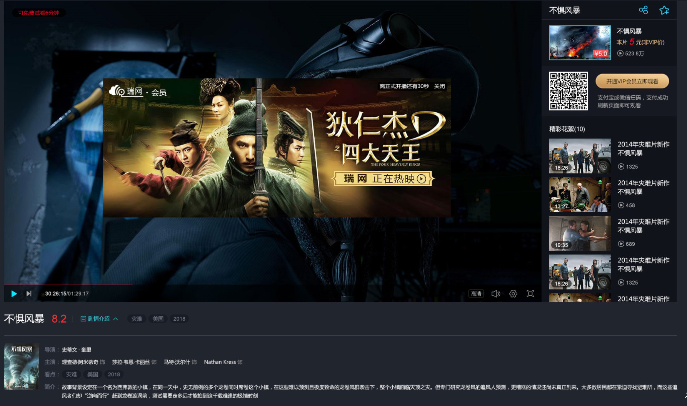
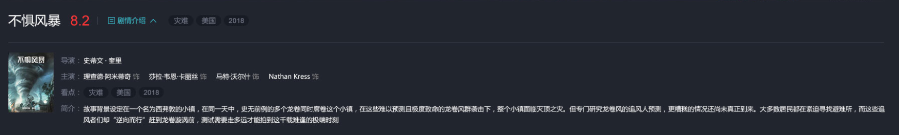
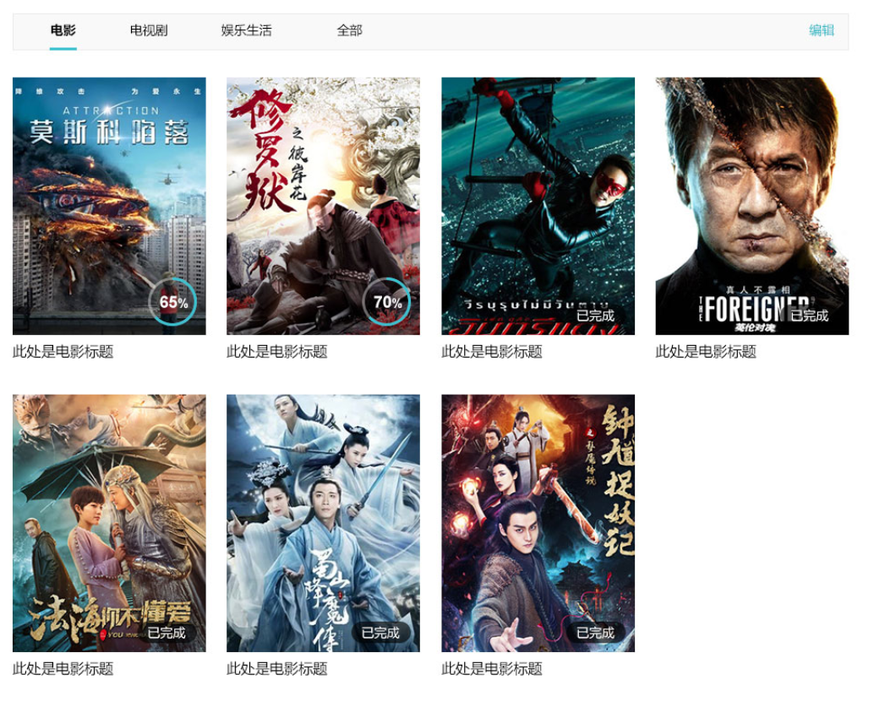
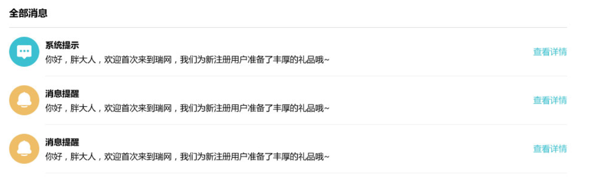

# 一、顶部导航

* logo
* 首页
* 导航
* 搜索框
* 登录注册/用户名
    * 登录注册是弹窗
* VIP标识
* 锐网青年计划（没有页面）

## 1、导航

## 2、搜索

* 搜索框
* 搜索按钮

# 二、轮播图

* 左右切换
* 自动切换
* 图片导航
* 图片

# 三、关键字列表

* 标题名
* 链接（更多按钮）
* 分类

# 四、图片列表（样式变化很多）

* logo
* 标题名
* 图片
* 小标签（可选）
* 更多按钮（可选）
* VIP专享影视排行按钮（可选）
* VIP标识（可选）
* 独家标识（可选）
* 自制标识（可选）
* 剧集标识（可选）
* 时长标识（可选）
* 名称（可选）
* 简介（可选）
* 评分（可选）
* 换一组按钮（可选）
* 多选按钮（可选）
* 剩余的时间（可选）

# 五、播放器

* 播放器
* 标题
* 第几集（电视剧有）
* 评分
* 剧情介绍
* 标题，分享按钮，收藏按钮
* 当前播放内容的图片
* 二维码和开通VIP按钮
* 电视剧集数的选择（电视剧有）
* 当前播放电影的花絮

## 1、播放器

* 播放画面
* 进度条
* 播放暂停按钮
* 下一集上一集按钮
* 当前时长/总时长
* 清晰度切换
* 音量调节
* 设置
* 全屏切换
* 广告
* 文字 “可免费试看6分钟”

### 1.1 播放器设置

* 进度条（可以拖动）
* 播放暂停按钮
* 下一集上一集按钮
* 当前时长/总时长
* 清晰度切换（应该是一个列表）
* 音量调节
* 设置
* 全屏切换

## 2、剧集介绍

* 视频名称
* 当前是第几集（电视剧有）
* 评分
* 小标签
* 收起展开功能（剧情介绍）
* 视频缩略图
* 导演
* 主演（视频详情页面显示）
* 看点（视频详情页面显示）
* 简介
* 播放次数（下载页面时显示）
* 更新至多少集（下载页面时显示）
* 地区（下载页面时显示）
* 类型（下载页面时显示）
* 语言（下载页面时显示）
* 年份（下载页面时显示）

## 3、当前播放的视频

* 电影名称
* 分享功能
* 收藏功能
* 当前电影的缩略图
* 缩略图中的价格标签
* 文字价格
* 播放次数

## 4、开通VIP

* 开通VIP的二维码
* 开通VIP的按钮
* 开通VIP的方式

## 5、当前播放电影的花絮

* 花絮的数量
* 缩略图
* 时长
* 名称
* 播放次数

# 六、排行榜

* 图标
* 栏目标题
* 顺序
* 名称
* 评分（可选）
* 视频缩略图（可选）

# 七、页面底部

* 跳转链接
* 版权

# 八、登录

* 标题

    * logo
    * 文字“登录”
    * 关闭按钮

* 输入框

    * 图标
    * 输入框
    * 清除按钮
    * 输入错误时会有错误提示

* 同意的协议和政策

    * 选择框
    * 在“用户协议”和“隐私政策”上加链接，需要跳转到相应页面

* 登录按钮

    * 点击登陆之后进行登录验证

* 新用户注册

    * 点击“新用户注册”跳转到注册弹窗

* 忘记密码

    * 点击“忘记密码”跳转到忘记密码弹窗（无忘记密码弹窗）

* 其他登录方式（单独划分为一个组件）

# 九、注册

* 标题

    * logo
    * 文字“登录”
    * 关闭按钮

* 输入框（没有密码输入框）

    * 输入框
    * 清除按钮
    * 输入错误时会有错误提示

* 同意的协议和政策

    * 选择框
    * 在“用户协议”和“隐私政策”上加链接，需要跳转到相应页面

* 注册按钮

    * 点击注册之后进行验证

* 账号密码登录

    * 点击“账号密码登录”跳转到登录弹窗

* 第三方快速登录
 
    * 和登录中“其他登录方式”功能一样，但是他应该怎么展示呢？
    * 点击之后跳转到哪里？

# 十、筛选

* 筛选标题
* 筛选的小标签

# 十一、排序

* 升序还是降序？这个没有标出来

# 十二、分页

# 十三、电视剧剧集的选择

* 集数的分组按钮
* 集数选择按钮

# 十四、电视剧下载的选择

* 图标
* 标题
* 集数的分组按钮
* 图片列表

# 十五、VIP信息展示

* 头像
* VIP标识（可选）
* 用户名
* 文字
* 按钮

# 十六、列表导航

* 图标（可选）
* 标题

# 十七、 tab切换

* 标题
* 编辑按钮
* 删除按钮
* 图片列表组件

# 十八、消息列表

* 标题
* 图标
* 消息标题
* 内容简介
* 查看详情按钮（没有页面）

# 十九、VIP缴费

* 当前状态
* 缴费时长
* 支付方式

## 1、VIP当前状态

* 标题
* 图标
* 小标题
* 到期时间

## 2、缴费时长

* 文字“推荐”
* 文字“时间”
* 小标签“优惠钱数”
* 价格/时间

## 3、支付方式

* 微信支付二维码
* 支付宝支付二维码
* 支付的金额
* 使用方法
* 不能银行支付么？

# 二十、基本设置

## 1、基本设置

* 标题
* 头像
* 更换头像按钮（没有跳转页面的图）
* 昵称
* 会员类型
* 续费按钮或开通VIP按钮（点击这个按钮会跳转到VIP管理页面？）

## 2、个性设置

* 标题
* 小标题
* 内容
* 设置按钮

# 二十一、安全设置

* 标题
* 手机验证
* 邮箱未绑定
* 密码

## 1、手机验证

* 图标
* 标题
* 手机号
* 修改手机号按钮

## 2、邮箱验证

* 图标
* 标题
* 信息提示

## 3、密码

* 图标
* 修改密码按钮
* 找回密码按钮
* 信息提示

