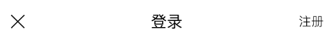

# 一、导航

* 图标
* 导航

# 二、搜索

* 搜索框
* 图标（这个有什么意义？）

# 三、轮播图（PC）

# 四、图片列表（PC）

* 图标
* 标题
    * 花絮，有数字
    * 首页，有标签
* 左侧按钮
    * 换一组
    * 更多
    * 查看全部
    * 特殊文案
* 视频缩略图
* 缩略图中标签
    * 更新至35集
    * VIP
    * 清晰度
    * 评分
* 视频名称
* 视频简介
* 视频当前更新到第几期
    * 只有首页推荐栏目有
* 支持横向滚动

# 五、播放器

* 分享按钮
* 收藏按钮
* 暂停/播放按钮
* 播放时长
* 播放进度条
* 视频总时长
* 全屏按钮

# 六、视频介绍

## 1、精简

* 视频名称
* 总共的集数/已经更新的集数
* 播放量
* 标签
* 评分
* 简介按钮
    * 点击后展开

## 2、详细（PC）

* 图片
* 视频更新状态
* 评分
* 标题
* 播放量
* 简介按钮
* 列表

# 七、电视剧剧集的选择（PC）

* 右侧按钮
    * 全部剧集（点击后展开）
    * 全部缓存
* 集数选择按钮
* 集数的分组按钮

# 八、底部导航

* 图标
* 导航名称

# 九、bar

* 左边
    * 返回按钮
    * 关闭按钮
    * 设置按钮
* 中间
    * 标题
* 右边
    * 注册
    * 对话
    * 编辑
    * 客服
    * 取消
    * 编辑
    * 筛选
    * 搜索
    * 登录
    * 空

# 十、 tab切换

* 标题
* 切换的内容

## 1、 切换的内容-list

* 图片
* 视频时长
* 名称
* 第几集
* 剩余时间
* 点击编辑时会出现“取消选择”和“删除”
* 多选按钮
* 滚动加载

## 2、下载组件（PC）

* 下载完成和list一样
* 下载中组件
    * 图片
    * 视频名称
    * 第几集
    * 进度条
    * 正在下载时显示下载的速度
    * 等待下载

# 十一、筛选（PC）

* 筛选标题
* 筛选的小标签

# 十二、排序（PC）

* 升序还是降序？这个没有标出来

<!-- # 十三、消息

* 图标
* 标题
* 内容简介

 -->

# 十三、设置

* 标题
* list
    * 单选按钮
    * 开关按钮
    * 选择框
    * 输入框
* 退出按钮

# 十四、VIP信息展示（PC）

* 头像
* VIP标识（可选）
* 用户名
* 文字
* 按钮

# 十五、list

* 图标
* 标题

# 十六、充值（PC）

# 十七、登录（PC）

同PC

# 十八、注册（PC）

同PC

